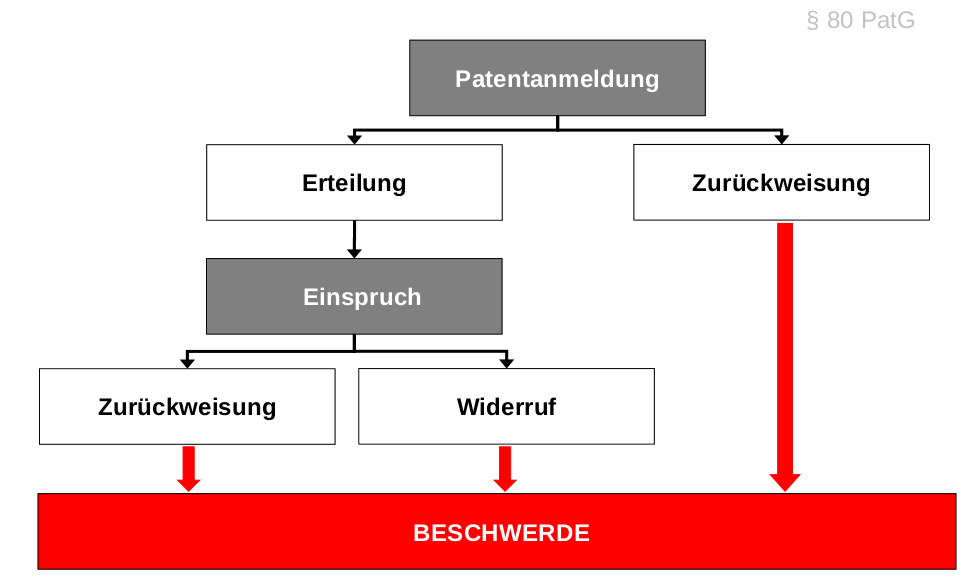
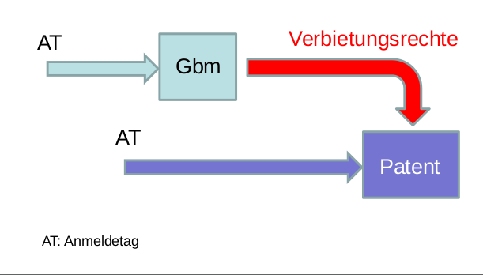
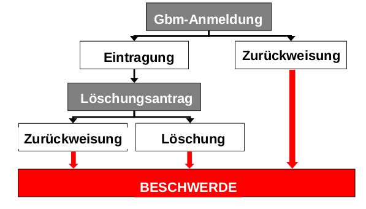

1 Entstehung, Inhalt und Wirkung des Patentrechts
==========================================================
Schützen der von Menschen geschaffenen geistigen bzw. immateriellen Güter für deren eigene Zwecke und vor der unbefugten Benutzung durch Dritte zu sichern
-> Also gewerblicher Rechtsschutz:
  1. technische gewerbliche Schutzrechte: Patente, Gebrauchsmuster
  2. nicht-technische gewerbliche Schutzrechte: Marken, Geschmacksmuster (z.B Form eines Regals, oder Marke "Coca Cola")
  3. Sortenschutzrecht
  4. Urheberrecht
  5. Wettbewerbsrecht

Verdienste des Erfinders sollen belohnt werden:
  1. Belohungstheorie (z.B Vergütung nach Arbeitnehmererfindergesetz)
  2. Ansporntheorie (sodass ein stetiger Entwicklungsprozess stattfindet)
  3. Naturrechts- oder Eigentumstheorie (geistiges Eigentum durch Gesetze schützen)
  4. Vertrags- oder Offenbarungstheorie (damit geistige Arbeiten nicht geheim gehalten werden)  

Patentfähige Erfindung (1. Vorlesung)
-------------------------------------
#### Erfindung (Lehre zum technische Handeln)
**Erfindung:**  
Tätigkeit technischer Natur, realisierbar und wiederholbar  
**NICHT Erfindungen**:  
Entdeckungen, wiss. Theorien, math. Methoden  
Ästhetische Formschöpfungen  
Verfahren für gedankl. Tätigkeiten, Programm für EDV  
Wiedergabe von Informationen
**Ausnahmen von der Patentierbarkeit:**  
Verwertung würde gegen öffentliche Ordnung oder die guten Sitten verstoßen  
z.B. Klonen von menschl. Lebewesen, genetische Identität, Verwednung von Embryonen zu industriellen oder kommerziellen Zwecken, Veränderung der genetischen Identität von Tieren, durch welche diese leiden.  

#### Neuheit
= Gehört **nicht** zum Stand der Technik  
**Stand der Technik** = alle Kenntnisse die vor dem für den Zeitrang der Anmeldung maßgeblichen Tag der Öffentlichkeit zugänglich gemacht worden sind (schriftlich, mündlich oder sonstige Weise)  
**Öffentlichkeit** = unbegrenzter Personenkreis hat die Möglichkeit zur Kenntnisnahme (ob sie das tun ist egal)  
Geheimhaltungsvereinbarungen schließen die Öffentlichkeit aus  
**Ausnahmen zum Zeitrang des Anmeldetags:**  
  * Ausstellungspriorität: 6 Monate rückwirkend
  * Missbrauchsausnahme: Bei widerrechtlicher Veröffentlichung durch dritte
  * nachveröffentlichte Patentanmeldung  

#### Erfinderische Tätigkeit
Wenn sie sich für den Fachmann **nicht in naheliegender Weise** aus dem Stand der Technik ergibt.  
**Fachmann** = Sachverständiger mit durchschnittlichem Wissen und Können, den man üblicherweise mit der Lösung der Aufgabe betrauen würde  
**nicht naheliegend wenn** es einem Durchschnittsfachmann am Prioritätstag nicht möglich gewesen ist.  
**Bestimmungsmethode (Aufgabe-Lösungs-Ansatz"):**  
  1. Merkmale der beanspruchten Erfindung
  2. Ermittlung des nächstliegenden St.d.T.
  3. Ermittlung der unterscheidenden Merkmale
  4. Ermittlung der Wirkungen die durch die unterscheidenden Merkmale erzielt werden
  5. Ermittlung der unterscheidenden Merkmale aus dem einschlägigen St.d.T.
  6. Ermittlung der aus dem St.d.T. bekannten Wirkungen, die mit den in 5 ermittelten Merkmalen erzielt werden
  7. Vergleich zwischen den Wirkungen nach 4 und 6
Wenn in 7 Übereinstimmung zeigt, fehlt es an erfinderischer Tätigkeit s. ab Folie 18 Kap1_2  

#### Gewerbliche Anwendbarkeit

Gilt als gewerblich anwendbar, wenn ihr Gegenstand auf irgendeinem gewerblichen Gebiet einschließlich der Landwirtschaft hergestellt oder benutzt werden kann.  
Beispiel für fehlende gewerbliche Anwendbarkeit: Verfahren zur Empfängnisverhütung, perpetuum mobile  

Das Patenterteilungsverfahren (2. Vorlesung)
--------------------------------------------
#### Vobereitungen
  * Vorab-Recherche (Fachliteratur, online-Datenbanken...)
  * Entscheidung Patent- oder Gebrauchsmusteranmeldung
  * Vorbereitung der Anmeldeunterlagen (Beschr., Zeichnungen...)
  * Entscheidung über Anmelder
  * Entscheidung über Anmeldeamt  

**Innere Priorität:** Falls innerhalb eines Jahres ab dem Anmeldetag wesentliche Änderungen oder Verbesserungen entwickelt worden sind, kann der Anmelder neu anmelden und den Zeitrang (Priorität) der früheren Anmeldung (Patent oder Gebrauchsmuster) beanspruchen.  

**Anmeldetag** ist der Tag, an dem die notwendigen Unterlagen beim Patentamt oder beim Patentinformationszentrum eingegangen sind (elektronisch, via Fax oder Post)  
Man erhält eine Empfangsbestätigung

####Patentanmeldung **muss** enthalten:  
  1. Namen des Anmelders  
    * Privat-Person, Gesellschaft, etc.
    * Sitz des Anmelders
    * bei Firmen ggf. Handelsregisterauszug
  2. Antrag auf Erteilung eines Patents
    * formlos (schriftl.) möglich
    * DPMA (deutsches Patent- und Markenamt) bietet Formular an
  3. einen oder mehrere Patentansprüche (s.o.)
    * Angabe dessen, was als patentfähig unter Schutz gestellt werden soll
    * Hauptansprüche, Nebenansprüche, Unteransprüche, Erzeugnisansprüche, Verfahrensansprüche, Verwendungsansprüche
  4. Beschreibung der Erfindung
  5. in Bezug genommene Zeichnugen  

Jedenfalls nachgreicht werden müssen:

  6. Anmeldegebühr (innerhalb von **3 Monaten** nach Anmeldetag, sonst gilt die Anmeldung als zurückgenommen (40 bzw. 60€)
  7. Zusammenfassung (innerhalb von **15 Monaten** nach Anmelde-/Prioritätstag einzureichen)
  8. Erfinderbennenung (Frist 15 Monate ab Anmelde- bzw. Prioritätstag)
  9. ggf. Übersetzung bei einem nicht-deutschen Anmeldungstext
  10. ggf. Prioritätserklärung bzw. -unterlagen

Das Recht auf das Patent hat der **Erfinder oder die Erfinder**. Wenn mehrere unabhängig voneinander die Erfindung gemacht haben, steht das Recht dem zu, der **zuerst beim Patentamt angemeldet hat.**

#####Zu 3: Patentanspruch

**Inhalt eines Patentanspruchs:** Angabe dessen was als patentfähig unter Schutz gestellt werden soll  
**Hauptanspruch:** Grundsätzlich der erste Patentanspruch, steht bei der Prüfung der Patentfähigkeit im Mittelpunkt und bestimmt was durch das Patent unter Schutz gestellt sein soll.  
**Unteranspruch:** Rückbezogen auf einen Hauptanspruch (z.B. "Vorrichtung nach dem Patentanspruch 1"), zusätzlich angegebene Merkmale. Schutzumfang des Hauptanspruchs wird beschränkt.  
**Nebenanspruch:** Schützt eine etwas andere Erfindung als der Hauptanspruch, unabhängig von anderen Patentansprüchen formuliert. zum Beispiel eine andere Lösung desselben technischen Problems beschreibt.  
**Aufbau eines Anspruchs (zweiteilig):** Oberbegriff (Angabe der Merkmale, die zum St.d.T. gehören), Kennzeichnender Teil (Angabe der Merkmale, für die in Verbindung mit den Merkmalen des Oberbegriffs Schutz begehrt wird)  
Getrennt durch "dadurch kennzeichnet"  

#####Zu 4: Beschreibung
Muss von einem Fachmann verstanden und ausgeführt werden können. St.d.T muss angegeben sein.  
Inhalt der Beschreibung legt Grenze (mit Ansprüchen und Zeichnungen), was in der Anmeldung offenbart wird und daher unter Schutz gestellt werden kann.

Aufbau der Beschreibung:
  1. dem Anmelder bekannter St.d.T.
  2. der Erfindung zu Grunde liegendes Problem (Aufgabe)
  3. die beanspruchte Erfindung (Lösung)
  4. Vorteile der Erfindung
  5. Weiterbildungen der Erfindung
  6. Ausführungsbeispiele (ggf. mit Figuren)

##### Zu 5: Zeichnungen
Dienen der Veranschaulichung einer Ausführungsvariante der Erfindung.  
Strichzeichnungen, also keine farbigen Abbildungen oder schattierte Darstellungen, einzelne Teile durch Bezugsziffern kennzeichnen, die in Beschreibung und/oder den Ansprüchen aufzunehmen sind.  

##### Zu 7: Zusammenfassung  
Innerhalb von **15 Monaten** nach Anmeldetag einzureichen.  
Umfasst Titel der Erfindung, Kurzdarstellung und eine signifikante Figur  
Dient der schnellen Orientierung, wird auf der ersten Seite veröffentlicht  

##### Zu 8: Erfinderbenennung
Anspruch folgt aus Erfinderpersönlichkeitsrechts  
Innerhalb von **15 Monaten** einzureichen, muss bei Patenterteilung zwingend vorliegen  
Gibt alle Erfinder unter Benennung ihrer Privatanschrift an  
Antrag auf NICHT-Benennung ist möglich

#### Die Offensichtlichkeitsprüfung
DPMA kontrolliert die Anmeldung auf Mängel (formell und/oder materiell), weißt den Erfinder darauf hin mit Frist zur Beseitigung. Falls Erfinder die Mängel in der Frist nicht beseitigt, droht die Zurückweisung der Anmeldung. Keine inhaltliche Prüfung!

#### Die Offenbarung der Erfindung
Fachmann muss in der Lage sein, die zum Patent anzumeldende technische Lehre auszuführen. Unterlagen für die Beurteilung des Offenbarungsgehaltes sind alle eingereichten UNterlagen, d.h Ansprüche, Beschreibungen und Zeichnungen. Alle Aspekte in diesen Unterlagen und die sich für den Fachmann objektiv ergeben sind offenbart.

Patenterteilungs- und Einspruchverfahren (3. Vorlesung)
-------------------------------------------------------
**Prioritätsrecht** innerhalb vom zwölf Monaten nach dem Anmeldetag steht dem Anmelder einer Patent- oder Gebrauchsmusteranmeldung für die Anmeldung der selben Erfindung zum Patent ein Prioritätsrecht zu. Kann nur für Merkmale in Anspruch genommen werden, die in der früheren Anmeldung deutlich offenbart sind.  

#####Rechercheantrag
Schriflicher, gebührenpflichtiger unabhänger Antrag seitens des Anmelders.  
Patentamt recherchiert die öffentlichen Druckschriften die für die Beurteilung der Patentfähgitkeit in Betracht zu ziehen sind.  
300€, ca. 6 Monate, Basis für weitere unternehmerische Entscheidungen.  
Vor dem Prüfungsantrag  

#####Prüfungsantrag
Patentamt prüft die Anmeldung auf formale Anforderungen und ob der Gegenstand patentfähig ist  
Kann vom Patentsucher und jedem Dritten bis zum Ablauf von 7 Jahren nach Einreichung der Anmeldung gestellt werden  
Unabhängiger Antrag, 350€ Gebühr, auf 150€ reduziert wenn Rechercheantrag gestellt ist.  
Im Anschluss erteilt der Prüfer dem Anmelder einen schriftlichen Prüfbescheid mit ermittelten St.d.T. nach Relevanz aufgeführt.  
Bei negativem Prüfbescheid muss der Anmelder Unterschiede und Vorteile der Erfindung darlegen und Ansprüche entsprechend einschränken. Erfolgt dies nicht, kann die Prüfungstelle die Anmeldung zurückweisen.  
Wenn formelle und materielle Anforderungen erfüllt sind, erlässt die Prüfungsstelle den Erteilungsbeschluss. Dadurch wird das Patent geschaffen, der Schutzumfang festgelegt und das Erteilungs- bzw. Prüfverfahren abgeschlossen.
#####Offenlegung
Einsicht steht jedermann frei wenn:
  * Anmelder mit Akteneinsicht einverstanden erklärt
  * 18 Monate nach Anmeldetag  

(Offenlegung mit **A** gekennzeichnet, Patente werden mit **B** gekennzeichnet) 

#####Prüfungsverfahren
Wenn die Anmeldung den formellen Anforderungen nicht genügt, fordert die Prüfungsstelle den Anmelder auf, die Mängel innerhalb einer bestimmten Frist zu beseitigen. Wenn keine patentfähige Erfindung vorliegt, hat der Anmelder eine Frist um sich unter Angaben von Gründen zu äußern.  
  * verlängerbare Frist regelmäßig 4 Monate
  * Bescheidserwiderung mit Änderung der Patentansprüche, techn. Argumentation, etc.
  * Durchschn. Prüfungsdauer ca. 2-2,5 Jahre

**Fristveräumnis - Weiterbehandlung**

Wenn nach Versäumung einer vom Patentamt bestimmten Frist die Patentanmeldung zurückgewisen ist, so wird der Beschluss wirkungslos. Anmelder kann **Weiterbehandlung** der Anmeldung beantragen und die versäumte Handlung nachholen. Dieser Antrag ist innerhalb einer Frist von **einem Monat** nach Zustellung der Entscheidung einzureichen.  
Gebühr 100€

**Teilung der Anmeldung**

Anmelder kann die Anmeldung jederzeit teilen. Der Zeitpunkt der ursprünglichen Anmeldung die Priorität **bleiben erhalten**  
Gleiche Gebühren für die abgetrennte Anmeldung, wie für die ursprüngliche Anmeldung.  
Zweck: Gestaltungsfreiheit des Anmelders  
Motiv: schnelle Erteilung, getrennte Lizensierung, Anpassung an Wettbewerb, Einwand der Uneinheitlichkeit  

Anmeldung wird zurückgewiesen, wenn die Mängel nicht beseitigt werden oder wenn keine patentfähige Erfindung vorliegt.  
Genügt die Anmeldung den Anforderung und ist der Gegenstand patentfähigt, beschließt die Prüfungsstelle die Erteilung des Patents.  
Mit der Veröffentlichung im Patentblatt treten die gesetzlichen Wirkungen des Patents ein.  

####Das Einspruchsverfahren
Innerhalb von 9 Monaten nach Veröffentlichung der Erteilung kann jeder gegen das Patent Einspruch erheben.  
Einspruch ist **schriftlich** zu erklären und zu **begründen**  
Stützt sich auf **Widerrufsgründe**
Angabe müssen, wenn sie nicht schon in der Einspruchsfrist enthalten sind, bis zum Ablauf der Einspruchsfrist schriftlich nachgereicht werden.  
Einspruchsgebühr (200€), deutsche Sprache, per Fax oder via Internet, mit umfassenden Angaben zu den Tatsachen, auf die sich der Einspruch stützt

Einspruchsgründe:

  1. Fehlende Patentfähigkeit
  2. Keine ausreichende Offenbarung
  3. Widerrechtliche Entnahme (ohne dessen Einwilligung etnommen)
  4. Unzulässige Erweiterung

#####Zu 3: widerrechtliche Entnahme:**
Wesentliche Übereinstimmung zwischen patentierter Erfindung und Erfindungsbesitz des Einsprechenden  
Tatbestandmerkmale:
  1. **Erfindungsbesitz** des Einsprechenden
  2. **Wesentliche Übereinstimmung** zwischen Patentierter Erfindung und Erfindungsbesitz des Einsprechenden
  3. **Widerrechtlichkeit** der Entnahme
  4. **Schutzfähgkeit** der patentierten Erfindung

Heißt es wurde eine Person im Patentregister eingetragen, die nicht berechtig ist, während der tatsächliche Erfinder tatsächlich nicht im Register vermerkt ist.  
Hat der Einspruch Erfolg, kann der Einsprechende **innerhalb eines Monats** die Erfindung **selst abnmelden** und die Priorität des früheren Patents in Anspruch nehmen.  

#####Zu 4. Unzulässige Erweiterung
Gegenstand des erteilten Patents ist mit dem Offenbarungsgehalt der ursprünglich bei der Anmeldung eingereichten Unterlagen zu vergleichen. Wenn der Gegenstand des Patents größer ist, liegt unzulässige Erweiterung vor.

#####Verfahrensablauf
Findet vor der zuständigen Patentabteilung des DPMA statt. Kontradiktorisches und öffentliches Verfahren, schriftliches Verfahren, ggf. Anhörung, Erwiderungsfristen von 3 Monaten, mündliche Verhandlung auf Antrag der Parteien, Rücknahme des Einspruchs jederzeit möglich

**Einspruchsende:** Patentabteilung entscheidet durch **Beschluss, ob und in welchem Umfang das Patent aufrechterhalten oder widerrufen wird.** Patent kann beschränkt aufrechterhalten werden, ist die Änderung der Patentschrift zu veröffentlicht.  
Patentabteilung kann **nach beliebigen Ermessen** bestimmen, inwieweit einem Beteiligten die Kosten zur Last fallen. Meistens trägt jeder Beteiligte sie selbst.  
**Verfahrenskostenhilfe** kann beantrag werden. Wenn genehmigt, kann die Gebühr zu einem späteren Zeitpunkt zahlen, z.B. durch Ratenzahlung auf sein Einkommen.  

Rechtsmittelverfahren (4. Vorlesung)
------------------------------------

####Beschränkungsverfahren
Patentinhaber kann das Schutzrecht freiwillig beschränken um einer Nichtigkeitsklage zuvor zu kommen. (120€) Begründeter Antrag mit Gründen für eine Beschränkung ist einzureichen. Patent kann widerrufen werden oder wenn es beschränkt wird, wird die geänderte Patentschrift veröffentlicht.  

####Beschwerdeverfahren
Gegen **Beschlüsse** der Prüfungsstellen und **Patentabteilungen** findet die Beschwerde statt.  
Beschwerde ist innerhalb **eines Monats** nach Zustellung schriftl. **beim Patentamt** einzulegen.  
Zwei zeitliche Abschnitte:  
 * zuerst wird sie der Stelle vorgelegt, die die angefochtene Entscheidung erlassen hat. Wenn zulässig und begründet, muss sie die Entscheidung selbst aufheben. Verfahren wird also beim DPMA zum Abschluss gebracht (**Abhilfeverfahren** genannt, nur einseitig)
 * Erachtet die Stelle die Beschwerde nicht für begründet, so hat sie innerhalb von **einem Monat** die Beschwerde dem BPatG vorzulegen  

**Formelle Erfordernisse der Beschwerde:**

  1. Statthaftigkeit der Beschwerde
  2. Beschwer (die Beschwerde einlegende Person ist durch die angefochtene Entscheidung in ihren Rechten belastet)
  3. Beschwerdeerklärung innerhalb der Beschwerdefrist
  4. Zahlung der Beschwerdegebühr (200€, bei Beschwerde gegen die Entscheidung einer Patentabteilung 500€)

**Es gibt Beschwerden aufgrund folgender Beschlüsse:**

  1. Gegen einen Beschluss der Prüfungsstelle   
  Beschwer des Anmelders aufgrund Verweigerung der Patenterteilung

  2. Gegen einen Beschluss der Patentabteilung  
    a) Beschwer des Anmelders aufgrund:  
       - vollständigem Widerruf des Patentes *oder*  
       - Widerruf des Patentes gemäß Haupt- und Erteilung des Patentes gemäß Hilfsantrag
    b) Beschwer des Einsprechenden aufgrund der Aufrechterhaltung des angegriffenen Patentes

Bei Verfahren vorm BPatG ist ein schriftliches Verfahren vorgelegt, aber auch mündliche Verhandlung möglich wenn:  
  1. einer der Beteiligten sie beantragt
  2. vor dem BPatG Beweis erhoben wird
  3. das BPatG sie für sachdienlich erachtet  

Dauer beträgt ca. 2 Jahre

BPatG kann Beschwerde:
  1. als **unzulässig verwerfen**
  2. als **unbegründet zurückweisen** (DPMA ist dann an diese Entscheidung gebunden)
  3. den **angefochtenen Beschluss (teilweise) aufheben**

Grundsätzlich trägt **jeder seine Kosten selbst**. Patentgericht kann aber auch entscheiden, dass die Kosten einem Beteiligten ganz oder teilweise zur Last fallen

####Rechtsbeschwerdeverfahren (am BGH)
* Bundesgerichtshof wird eingeschaltet, bei Rechtsbeschwerde gegenüber Beschlüssen der Beschwerdesenate des Patentgerichts.   
* Innerhalb eines Monats nach Beschluss des BPatG beim BGH schriftlich einzulegen.  
* Anschließend binnen eines Monats Begründung der Beschwerde.  
* Steht nur Beteiligten zu  
* Vertretung kann durch Rechtsanwalt oder Patentanwalt  
* Hat aufschiebende Wirkung
* Kosten von einem Beteiligten ganz oder teilweise (sofern es der Billigkeit entspricht)
* 3. Instanz nach DPMA und BPatG  

Beschwerdesenat muss die Rechtsbeschwerde im Beschluss zulassen, sie ist zuzulassen, wenn:

  1. eine **Rechtsfrage von grundsätzlicher Bedeutung** zu entscheiden ist *oder*  
  2. die **Fortbildung des Rechts** oder die Sicherung einer **einheitlichen Rechtsprechung** eine Entscheidung des BGH fordert (z.B. zwei Senate des BPatG haben unterschiedlich entschieden)

Rechtsbeschwerde ist zulassungsfrei wenn:

  1. Gericht nicht vorschriftmäßig besetzt
  2. Richter hat mitgewirkt, der vom Richteramt ausgeschlossen oder wegen Befangenheit abgelehnt war
  3. einem Beteiligten rechtliches Gehört versagt war
  4. ein Beteiligter nicht nach Vorschrift vertreten war
  5. Beschluss auf Grund einer mündlichen Verhandlung, bei der die Vorschriften über die Öffentlichkeit des Verfahrens verletzt worden sind
  6. Beschluss nicht mit Gründen versehen war

Findet statt am X. Zivilsenat: Rechtsstreitigkeiten über Patent- und Gebrauchsmuster, Arbeitnehmererfindungen, Patentnichtigkeitssachen, Zwangslizenssachen...

####Nichtigkeitsverfahren
* Erste Instanz das BPatG, zweite Instanz der BGH.
* Wird eingeleitet durch **Klage** gegen den im Register eingetragengen **Patentinhaber**.
* Kann erst **nach Abschluss aller Einspruchsverfahren** erhoben werden, also nach dreimonatgier Frist zur Einlegung des Einspruchs
* schriftlich beim Patentgericht zu erheben
* Gegenstand des Nichtgkeitsverfahrens ist **den Nachweis zu erbringen, dass ein erteiltes Patent zu Unrecht besteht**
* Einmontige Erwiderungsfrist für Patentinhaber, wenn kein Widerspruch dann ist direkte Entscheidung des BPatG möglich
* ca. 2 Jahre für die erste Instanz
* Über die Klage wird durch **Urteil** entschieden
* Mit dem Urteil wird auch über die Kosten des Verfahrens entschieden (meist die unterlegene Partei)

#####Nichtigkeitsgründe
  1. der Gegenstand **nicht patentfähig** ist, und **mangelnde Offenbarung**
  2. **widerrechtliche Entnahme** s.o.
  3. **Gegenstand des Patents geht über den Inhalt der Anmeldung hinaus**

####Berufungsverfahren
* Gegen die **Urteile der Nichtigkeitssenate** des BPatG findet die Berufung **am Bundesgerichtshof** statt
* Einreichung der **Berufungsschrift** am BGH
* **Berufungsfrist von einem Monat**
* **Begründung der Berufung** ist erforderlich **innerhalb von drei Monaten** nach Einlegung der Berufung
* Berufungsschrift muss enthalten:
  1. Bezeichnung des Urteils, gegen das die Berufung gerichtet wird
  2. die Erklärung, dass gegen dieses Urteil Berufung eingelegt wird
* Berufung kann gestützt werden darauf, dass **die Entscheidung des Patentgerichts auf der Verletzung des Bundesrechts beruht**
* Wie beim Rechtsbeschwerdeverfahren müssen die Beteiligten vor dem BGH durch einen **zugelassenenen Rechtsanwalt oder Patentanwalt vertreten lassen**
* Beim Urteil wird auch über die Kosten entschieden

Allgemeine Verfahrensregeln (Vorlesung 5)
-----------------------------------------
Vor dem Patentamt, Patentgericht und dem Bundesgerichtshof

####Untersuchungsgrundsatz
**Patentgericht** und **Patentamt** erforschen den Sachverhalt von Amts wegen. Also sie können auch selbst Recherchen durchführen oder ergänzende Beweise anfordern. Vertreten die Interessen der (nicht beteiligten) Öffentlichkeit. Mitwirkungspflicht der Beteiligten.

####Wahrheitspflicht
Im Verfahren vor dem Patentamt, dem Patentgericht und dem Bundesgerichtshof haben die Beteiligten ihre Eklärungen über tatsächliche Umstände **vollständig und der Wahrheit gemäß** abzugeben. Betriff z.B. bewusste Lüge, Halbwahrheiten, Verschweigen, Folgen sind strafbarer Prozessbetrug, Zurückweisung der Anmeldung...

####Fristversäumnis
#####Weiterbehandlung
* Wenn nach **Versäumung einer vom Patentamt bestimmten Frist** die **Patentanmeldung zurückgewiesen worden ist**
* Anmelder kann **Weiterbehandlung der Anmeldung** beantragen und die **veräumte Handlung nachholen** (und 100€)
* Antrag innerhalb **einer Frist von einem Monat** (nach Zustelltung der Zurückweisung der Patentanmeldung) einzureichen
* Versäumte Handlung ist innerhalb dieser Frist nachzuholen

#####Widereinsetzung
* Wer **ohne Verschulden** verhindert war, eine Frist einzuhalten (DPMA oder BPatG) , deren **Versäumung nach gesetzl. Vorschrift einen Rechtsnachteil zur Folge hat**, ist auf **Antrag** wieder in den vorigen Stand einzusetzen

**Widereinsetzung nur unter folgenden Bedingungen**

  1. Versäumung einer durch Gesetz angeordneten Frist
  2. Kein Verschulden bei der Fristversäumung
  3. Antragstellung innerhalb von **zwei Monaten** nach **Wegfall des Hindernisses**
  4. Nachholung der versäumten Handlung **innerhalb der zwei Monate**

Ein Jahr nach Ablauf kann die Wiedereinsetzung nicht mehr beantragt und die versäumte Handlung nicht mehr nachgeholt werden.  
Tatsachen: Krankheit, Übermittlungsfehler, Überweisungsprobleme, Streiks, Katastrophen

Die Wiedereinsetzung führt zur vollständigen Beseitigung der Folgen der Säumnis.

####Vertretung
* In der Regel kann jeder Beteiligte seine Sache selbst vertreten
* Wer im **Inlad weder Wohnsitz, Sitz, noch Niederlassung** hat, kann an einem **Verfahren** vor dem **Patentamt** oder dem **Patentgericht** nur teilnehmen, wenn er im Inland einen **Rechtsanwalt oder Patentanwalt als Vertreter bestellt hat**, der zur Vertretung bevollmächtig ist.

Das erteilte Patent (immer noch Vorlesung 5)
--------------------------------------------
####Der Patentschutz
* max. 20 Jahre ab Anmeldetag
* Steigende Jahresgebühren (für das dritte und jedes folgende Jahr)
* Schutzbereich wird durch den **Inhalt der Patentansprüche** bestimmt. (Beschr. und Zeichn. sind hinzuzuziehen)
* Schutzdauer kann enden wenn:
  1. 20 jährige Schutzfrist vorüber
  2. Abgabe einer Verzichtserklärung des Inhabers an das DPMA
  3. nicht rechtzeitige Abgabe der Erfinderbenennung
  4. Nichtzahlung einer fälligen Jahresgebühr
  5. Widerruf des Patents
  6. Nichtigerklärung des Patents

##### Wirkung des Patenschutzes
Patentinhaber allein darf die Erfindung  im Rahmen des geltenden Rechts **benutzen**

Jedem **Dritten** ist es verboten, ohne seine Zustimmung:  
  1. ein **Erzeugnis** **herzustellen, anbieten, in Verkehr zu bringen oder zu gebrauchen**
  2. ein **Verfahren** **anzuwenden**, oder anzubieten
  3. Das durch ein **Verfahren** **unmittelbar hergestellte Erzeugnis anzubieten**

#####Übertragung des Patents
* Recht auf das Patent, der Anspruch auf Erteilung des Patents und das Recht aus dem Patent können beschränkt oder unbeschränkt auf andere übertragen werden
* Gegenstand von Lizenzen
* Lizenzen die vorher erteilt worden sind werden nicht durch Rechtsübergang oder die Erteilung einer Lizenz berührt

####Grenzen des Patentschutzes
Wirkung erstreckt sich **nicht** auf:
  1. Handlungen im **privaten Bereich**
  2. Handlungen zu **Versuchzwecken**
  3. unmittelbare **Arzneimittelzubereitung in Apotheken**  
(  
  4. An Bord von **Schiffen** (ausschließlich für die **Bedürfnisse des Schiffes**)
  5. Gebrauch in der **Bauausführung oder für den Betrieb der Luft- oder Landfahrzeuge**  
)

#####Territorialitätsprinzip
Wirkungen aus einem deutschen Patent finden **nur in Deutschland Anwendung**, weil sie aus dem deutschen Patentgesetz resultieren

#####Weiterbenutzungsrecht
Jemand hat zur **Zeit der Anmeldung bereits im Inland** die Erfindung in **Benutzung** genommen oder die dazu **erforderlichen Veranstaltungen getroffen**  
Dieser ist dann **befugt** die Erfindung **für die Bedürfniss seines eigenen Betriebs auszunutzen**

#####Öffentliches Interesse
Wirkung des Patents tritt nicht ein, wenn die **Bundesregierung** anordnet, dass die Erfindung im Interesse der **öffentlichen Wohlfahrt** benutzt werden soll.  
Patentinhaber hat gegen den Bund **Anspruch auf angemessene Vergütung**

#####Zwangslizenz
Eine **nicht ausschließliche Befugnis** zur gewerblichen Benutzung einer Erfindung wird durch das BPatG erteil sofern:  
   1. Lizensucher sich **erfolglos bemüht** hat, vom Patentinhaber Zustimmung zu erhalten
   2. das **öffentliche Interesse** die Erteilung einer Zwangslizenz gebietet

#####Erlöschen des Patents
Wenn:  
  1. Patentinhaber darauf durch schriftl. Erklärung an das Patentamt **verzichtet**
  2. **Erfinder-Erklärungen** werden nicht rechtzeitig abgegeben
  3. **Jahresgebühr** wird nicht rechtzeitig gezahlt

#####Widerruf/Nichtigkeit des Patents
Patent wird auf Antrag (teilweise) widerrufen, wenn  
  1. der Gegenstand nicht patentfähig ist
  2. das Patent die Erfindung nicht vollständig offenbart
  3. wesentlicher Inhalt des Patents widerrechtlich entnommen wurde
  4. Gegenstand des Patents geht über den Inhalt der Anmeldung der ursprünglich eingereichten Fassung hinaus

Mit dem Widerruf gelten die Wirkungen des Patents und der Anmeldung als von Anfang an nicht eingetreten.

Durchsetzung des Patentschutzes (Vorlesung 6)
---------------------------------------------
(Maßnahmen, die sich gegen Patentverletzungen richten)  

Die Zivilkammern der **Landgerichte** sind zuständig für Klage in Patentstreitsachen, ohne Rücksicht auf den Streitwert. Das Gericht, in dem der Beklagte seinen Wohnsitz bzw. Sitz hat. Berufungen am Oberlandesgericht, Revision zum BGH. Meist Doppelvertretung durch Rechtsanwalt und Patentanwalt.

* **Verteidigungsstrategien** im Verletzungsverfahren:  
  a) Bestreiten der Verletzungshandlung   
  b) Geltendmachung von eigenen Benutzungsrechten  
* zweites Verfahren urteilt über die Höhe des Schadensersatzes  

####Schadensersatz
#####Voraussetzungen 
  1. objektiv Vorliegende Patentverletzung
  2. nachweisbarer Schaden durch Patentverletzung
  3. Verschulden (Vorsatz/Fahrlässigkeit)

#####Berechnungsarten des Schadens (eine von dreien)
  1. Ersatz des entgangenen Gewinns (Verletzte muss viel offenelgen, daher nicht so weit verbreitet)
  2. angemessene Lizenzgebühr (Fiktiver Lizenzsatz, den die Parteien vereinbart hätten; am weitesten verbreitet; fehlender "Bestrafungscharakter" für Verletzer)
  3. Herausgabe des Verletzergewinns (Verletzer legt seinen Gewinn mit dem Verletzungsgegenstand offen; Problem "Verletzer rechnet sich arm")

####Ansprüche aus Patentverletzung
* Wer eine patentierte Erfindung benutzt, kann vom Verletzen auf **Unterlassung** in Anspruch genommen werden
* Wer die Handlung **vorsätzlich oder fahrlässig** vornimmt, ist zum **Ersatz des daraus entstandenen Schadens** verpflichtet
* Verletzte kann verlangen, dass das **patentverletzende Erzeugnis vernichtet** wird
* Verletzer kann vom Verletzer **unverzügliche Auskunft über die Herkunft und den Vertriebsweg** des betreffenden Erzeugnisses verlangen

####Strafrechtliche Ansprüche
**Freiheitsstrafe bis zu 3 Jahre** oder **Geldstrafe** wenn:

  1. ein Erzeugnis, das Gegenstand des Patents ist, benutzt *oder*
  2. ein Verfahren, das Gegenstand des Patents ist, anwendet oder zur Anwendung bietet

Handelt der Täter gewerbsmäßig, Freiheitsstrafe bis zu fünf Jahren oder Geldstrafe  
Der Versuch ist strafbar

####Patentberühumung
Wer Gegenstände durch Kennzeichnungen den Eindruck erweckt, dass sie **durch ein Patent oder eine Patentanmeldung geschützt seien**, ist **verpflichtet jedem**, **Auskunft darüber zu geben**, auf welches Patent oder Patentanmeldung sich die Verwendung der Bezeichnung stützt.

In den USA ist sowas vorgeschrieben, in Deutschland nicht. Aber es kann empfohlen sein.

####Zollbeschlagnahme
bei Einfuhr oder Ausführ findet **Beschlagnahme durch die Zollbehöre statt**, sofern die Rechtsverletzung **offensichtlich** ist. Wenn es ein geschütztes Patent ist, auf **Antrag und gegen Sicherheitsleistung** des Rechtsinhabers.  
Größter Teil sind Markenrechtsverletzungen (95,94%)

####Durchsetzung der Rechtsansprüche
* vorab **Berechtigungsanfrage** oder **Verwarnung** des vermeintlichen Verletzers
* Hierbei Hinweise auf **relevante Schutzrechte** und **Verletzungshandlung** und **Aufforderung zur Stellungnahme**
* Verwarnung umfasst **Unterlassungsaufforderung**

#####Unterlassungsanspruch
Wenn jemand eine durch ein Patent geschütze Erfindung oder ein durch ein Patent geschütztes Verfahren benutzt, kann vom Verletzten auf **Unterlassung in Anspruch genommen werden**.  
Häufiger Einwand ist das Vorbenutzungsrecht, unrechtmäßige Entwendung.  
Unterlassungsanspruch unterliegt Verjährung (3 Jahre ab Kenntnis von der Person des Verletzers und der Verletzung, ansonsten in 10 Jahren nach der Patentverletzungshandlung)

####Einstweilige Verfügung (schnellverfahren)
Gericht untersagt dem mutmaßlichen Verletzer, die angegriffene Veletzungsform herzustellen, anzubieten oder zu vertreiben. Falls dies nicht stimmte, kann das hohe Schadensersatzzahlungen nach sich ziehen.  
Verlangt Antrag, Eilbedürftigkeit und klare Verhältnisse (häufig für Messen relevant)

2 Gebrauchmusterrecht (Vorlesung 7)
===================================

* **Erfindungen**, die **neu** sind, auf einem **erfinderischen Schritt** beruhen und **gewerblich anwendbar sind**
* Registerrecht, d.h kein amtliches Prüfverfahren auf Schutzfähgkeit, also schnelle Eintragung und Geltendmachung möglich
* **Verfahren sind ausgeschlossen**
* **Begrenzung der Schutzdauer** auf höchstens 10 Jahre (erst drei Jahre, dann Gebühr für weitere drei Jahre, dann jeweils 2 Jahre)
* ausgenommene Gegenstände
  * wiss. Theorien und math. Methode
  * ästethische Formschöpfungen
  * Programme für Datenverarbeitungsanlagen
  * Wiedergabe von Informationen
  * biotechnologische Erfidungen
* als Gebrauchsmuster werden nicht geschützt
  1. Erfindungen deren Verwertung gegen die öffentliche Ordnung oder die guten Sitten verstoßen würde
  2. Pflanzensorten oder Tierarten
  3. Verfahren

**Schutz erlischt**, durch

  1. Ablauf der Schutzdauer von drei bzw. sechs bzw. acht bzw zehn Jahre nach Anmeldetag
  2. Verzicht
  3. Löschung

####Neuheit
Gegenstand eines Gebrauchsmusters gilt also neu, wenn er nicht zum St.d.T. gehört.  
Gegenüber dem Patent gilt ein eingeschränkter St.d.T.
Mündliche Mitteilungen in der Öffentlichkeit (z.B. Vorträge oder Rundfunksendungen) nur dann, wenn eine offenkundige Benutzung erfolgt ist.

#####Neuheitsschonfrist
Wenn **6 Monate vor** dem Anmeldungstag eine **Beschreibung oder Benutzung** erfolgte, bleibt diese **außer Betracht**, wenn sie auf der Ausarbeitung des **Anmelders** beruht

####Gebrauchsmusteranmeldung
Anmeldung muss enthalten:

  1. Namen des Anmelders
  2. einen Eintragungsantrag (Formblatt)
  3. einen oder mehrere Schutzansprüche (was soll als schutzfähig unter Schutz gestellt werden)
  4. eine Beschreibung des Gegenstandes
  5. die Zeichnungen, auf die sich die Schutzansprüche oder die Beschreibung beziehen

####Eintragungsverfahren
Es findet vor der Eintragung nur eine Prüfung auf Ordnungsmäßigkeit statt, keine Prüfung auf Neuheit, erfinderischen Schritt oder gewerbliche Anwendung. Änderungen in der Anmeldung sind zulässig bist zur Verfügung über die Eintragung (solange sie den Gegenstand der Anmeldung nicht erweitern). Einsicht in das Register steht jedermann frei.  

Weitere Erfordernisse:

* Nur in deutscher Sprache
* Zeichnungen können nachgereicht werden (Anmeldetag wird dementsprechend verschoben)
* Anmeldegebühr (aktuell 40€)
#####Abzweigung
Anmeldetag der früher eingereichten Patentanmeldung für eine neue Gebrauchmusteranmeldung in Anspruch nehmen (also die Priorität einer Patentanmeldung beanspruchen)  
Kann bis zum Ablauf von zwei Monaten nach dem Ende des Monats des Endes der Patentanmeldung bzw Einspruchsverfahren ausgeübt werden.  
Es können mehrere Gebrauchsmuster (für verschiedene Gegenstände) aus einer Patentanmeldung abgezweigt werden.  
z.B. bei 
* drohendem Zurückweisungsbeschluss in der Patentanmeldung
* erwünschter schneller Verfügbarkeit eines Schutzrechts
* "Optimierung" der Schutzansrpüche auf eigenes oder fremdes Produkt

#####Antrag auf Recherche
* Patentamt ermittelt auf Antrag die öffentlichen Druckschriften, die in Betracht zu ziehen sind
* Antrag kann vom Anmelder, dem als Inhaber Eingetragenen und jedem Dritten gestellt werden
* ermittelter St.d.T. wird mit veröffentlicht
* Amt ermittelt und übersendet materiell relevante Druckschriften des St.d.T. (300€)

####Prioritätsrecht
* Anmelder steht innerhalb einer **Frist von zwölf Monaten** nach dem Anmeldetag einer eingereichten **früheren Patent- oder Gebrauchsmusteranmeldung**, für die Anmeldung **derselben Erfindung** ein Prioritätsrecht zu
* **Austellungspriorität** wenn Anmelder auf einer inländischen oder ausländischen Ausstellung zur Schau gestellt hat, kann er von diesem Tag **Prioritätsrecht** in Anspruch nehmen, innerhlab einer **Frist von sechs Monaten**

####Wirkung des Gebrauchsmusters
* Schutzbereich wird durch den Inhalt der **Schutzansprüche** bestimmt
* Beschreibung und Zeichnungen sind **zur Auslegung** der Schutzansprüche heranzuziehen
#####Nichteintritt der Wirkungen
* Wenn gegen den als Inhaber Eingetragenen ein **Anspruch auf Löschung besteht**
* widerrechtliche Entnahme (Beschreibungen, Zeichnungen, Modelle... ohne dessen Einwilligung entnommen)
* Wenn ein Patent später angemeldet wurde, darf das Recht ohne die Erlaubnis des Inhabers des Gebrauchsmusters nicht ausgeübt werden

#####Unmittelbare Wirkung der Eintragung
* allein der **Inhaber** ist befugt, den Gegenstand des Gebrauchsmusters **zu benutzen**
* jedem **Dritten** ist es **verboten**, ein Erzeugnis ohne seine Zustimmung, **herzustellen, anzubieten, in Verkehr zu bringen oder zu gebrauchen** (eigentlich wie bei Patentrecht)

#####Mittelbare Wirkung der Eintragung
wtf? lücke... (folie 175)

#####Grenzen des Gebrauchsmusterschutzes
Wirkung des Gebrauchsmusters erstreck sich nicht auf:

  1. Handlungen, die im **privaten Bereich** zu nichtgewerblichen Zwecken vorgenommen werden
  2. Handlungen zu **Versuchszwecken**
  3. Wie bei Patentrecht (Arzneimittel, Schiffe und Flugzeuge)

####Löschungsverfahren
**Jedermann** hat gegen den als Inhaber Eingetragenen **Anspruch auf Löschung** des GM, wenn

  1. Gegenstand des GM **nicht schutzfähig** ist
  2. Gegenstand des GM **bereits in früherer Patent oder GM Anmeldung geschützt** worden ist
  3. **Gegenstand des GM über** den **Inhalt der Anmeldung hinausgeht**, in der sie ursprünglich eingereicht worden ist

Bei **widerrechtlicher Entnahme** steht nur dem Entnommenen ein Anspruch auf Löschung zu  

Löschung kann nur in Teil des Gebrauchsmuster passieren.

#####Voraussetzungen
  1. Antrag
  2. Angabe der den Löschungsantrag begründenden Tatsachen und Beweismittel
  3. Zahlung der Löschungsgebühr (300€)

#####Ablauf
  1. DPMA teilt dem Inhaber der Antrag mit, er soll sich **innerhalb eines Monats erklären**
  2. **Widerspricht er nicht rechtzeitig** erfolgt die Löschung, andernfalls ein kontradiktorisches Verfahren
  3. Über den Antrag wird auf Grund **mündlicher Verhandlung** beschlossen in **1. Instanz** in der **Gebrauchsmusterabteilung des DPMA**, **zweite Instanz bei BPatG Beschwerdesenat** auf Antrag
  4. Patentamt bestimmt darüber zu welchem Anteil die Kosten auf die Beteiligten verteilt werden

#####Rechtsmittel
Gegen Beschlüssen findet die **Beschwerde** an das **Patentgericht** statt

Gebrauchsmustergesetz verweist bei einer Vielzahl von Verfahren auf das Patentgesetzt, z.B. für

  * Zwangslizenzen
  * Wiedereinsetzung in den vorigen Stand
  * Wahrheitspflicht im Verfahren
  * Bewilligung von Verfahrenskostenhilfe

####Übertragungs- und Lizenzrecht
* Recht auf Gebrauchsmuster kann auf **andere übertragen** werden
* Rechte können **Gegenstand von Lizenzen sein**
* Rechtsübergang **berührt nicht** Lizenzen, die Dritten vorher erteilt worden sind

####Rechtsansprüche aus Gebrauchsmuster
* Verletzer kann verlangen dass das **Erzeugnis vernichtet** wird
* Verlangen einer unverzüglichen **Auskunft über Herkunft und Vertriebsweg**
* **einstweilige Verfügung** bei offensichtlicher Rechtsverletzung
* **strafrechtliches Verfahren** auf Antrag oder öff. Interesse
* **Beschlagnahme durch Zollbehörde** auf Antrag und gegen Sicherheitsleistung bei seiner Ein- oder Ausfuhr, wenn die Rechtsverletzung offensichtlich ist
* Bei **Gebrauchsmusterstreitsachen** sind die Zivilkammern der Landgericht ohne Rücksicht auf den Streitwert zuständig

####Verteidigung gegen Gebrauchsmusterverletzung
mit folgenden Argumenten kann der einer Gebrauchsmusterverletzung Beschuldigte sich wehren:

  * Nichtbenutzung der geschützen Lehre
  * fehlende Rechtsbeständigkeit des Klagegebrauchsmusters
  * eigenes Benutzungsrecht
  * Verjährung/Verwirkung

3 Lizenzvertragsrecht
===============================

4 Das Arbeitnehmererfinderrecht
=========================================

5 Zusammenfassung
=================
Zwei Teile
Teil I: 31 Verständnisfragen (schriftlich)
Teil II: 30 Multiple choice  mit 4 Behauptungen (wahr oder falsch)
Alles Kapitelweise

####Patentrecht
4 materielle schutzvorraussetzungen  
was ist eine erfindung, was ist keine  
was ist Neuheit, was ist St.d.Technik (BIS zum, also vor dem Anmeldetag), welche Formen der Öffentlichkeit zugänglich gemacht  
Durchschnitts-Fachmann (bestimmt ob es zugänglich gemacht wurde), erklären  
Erfinderische Tätigkeit, Aufgabe-Lösungs-Ansatz, Beispiele positiv-negativ  
Was muss beim Amt vorliegen, damit ich den Anmeldetag bekomme, was kann nachgereicht werden  
Wer hat das Recht auf die Anmeldung  
Beschreibung und Ansprüche, welche Arten von Ansprüchen, wie sind die aufgebaut, Oberbegriff und kennz. Teil  
Optionale Anträge (zB Recherche, Prüfungsantrag (Frist? 7 Jahre | Pflicht?) Anmeldung wird nach 18 Monaten veröffentlicht, Anmeldegebühr 3 Monate  
Akteneinsicht, Offenlegung  
**Fristen:**  
Wiedereinsetzung (gesetzliche Frist), zurück nur durch Nachweis, dass nicht eigens verschuldet (Gebühr), 1 Jahr nach Wegfall der Hindernisses (der Unkenntnis, also dass es einem selbst bekannt wird), Antrag 2 Monate Zeit?  
Weiterbehandlung (vom Amt gestellt, z.B. in Brief), zurück ins Verfahren durch Antrag auf Weiterbehandlung und zusätzl. Gebühr  

Untersuchungsgrundsatz, Wenn man was zum Patentamt schickt...  
Wahrheitspflicht

**Widerspruchsverfahren:**  
9 Monate Frist, bei veröffentlichung des Hinweises auf Patenterteilung, steht jedermann zu (außer Inhaber) , mit allen Tatsachen  
Gegenstand geht über die eig. Offenbarung Hinaus, unzulässige Änderung, Patentfähigkeit, Erfinder bei widerrechtlicher Entnahme (s.o.), Fachmann kann es nicht nachvollziehen  
Wie läuft das Verfahren ab, wer ist beteiligt, kontradiktorisch  
Widerrechtliche Entnahme, was muss ich beweisen/nachweisen, Identität, zum Anmeldetag bekannt?, muss schutzfähig sein  
Wer trägt die Kosten  

**Beschränkungsverfahren:**  
Brauche ein Patent, Sperre wenn Einspruchsverfahren, Wirkung in Zukunft und Vergangenheit also auch rückwirkend  

**Beschwerde:**  
Rechtsmittel gegen Entscheidung vom DPMA: Beschwerde (brauch ein Beschluss) innerhalb von 1 Monat nach Zustellung der negativen Entscheidung beim Patentamt  
Geht zurück ins Prüfungsverfahren (komplett Widerrufen) ansonsten geht es weiter zum Patentgericht  
Abhilfeverfahren nur im einseitigen Verfahren (für den Fall, dass ich nicht in einem kontradiktorischen Verfahren)  
Wie sieht Beschwerdeentscheidung aus (Tenor?): Gericht kann Beschwerde als unzulässig verwerfen oder als unbegründet zurückweisen, Beschluss ausfheben  

**Nichtigkeitsklage:**  
Wann, wo und wer: Jederzeit nach Ablauf der Anspruchsfrist, gegen Patentinhaber, Klage schriftl. ans Patentgericht  
Gründe: wie im Einspruchsverfahren plus Schutzbereich erweitert worden  
Wenn man mit der Entsch. des Nichtigkeitsausschusses nicht zufrieden ist: Nichtigkeitsberufung im BGH Frist 1 Monat  

**Verletzungsthematik:**
Schutzbereichsbestimmung: Auslegung anhand von Beschreibung, Zeichnungen  
Auslegungen vom Schutzbereich, wo sind die Grenzen: Wortsinngemäß ist die engste, Äquivalente ist weiter gefasst  
Wirkungen: mittelbar (nur einen Teil anzubieten) und unmittelbar (Herstellen Anbieten.. Das Verfahren anwenden)  
Handelsübliches ist vom mittelbaren ausgeschlossen  

Wie lange ist Patent wirksam (max. 20 Jahre durch bezahlen der Gebühren, jährlich ansteigender Betrag, Beträge werden nicht abgefragt)  
Aufrechterhaltungsgebühr in Intervallen 10 Jahren max bei Gebrauchsmustern!!  

Verletzungsprozess vor den Landgerichten, als Klage  

Als vermeintlicher Verletzer, welche Verteidigungsargumente? gewerbl. Nutzung, bereits intern verwendet (eigene Benutzungsrechte), Verletzungstatbestand bestreiten  
Verjährung, Verwirkung als Verteidigung  

Patentinhaber steht Schadensersatz zu (Patentverletzung, Schaden entstanden, vorsätzlich/fahrlässig, Kausalität zwischen Schaden und Verletzung)  
Anspruchsgrundlagen für Schadensersatz  

####Gebrauchsmusterrecht
Stand der Technik, Benutzung nur im Inland, irgendwas weltweit  
Neuheitsschonfrist, max. 6 Monate und vom Erfinder selbst bleiben unberücksichtigt  

**Gebrauchsmusterabzweigung** was ist das, was braucht man, zu welchem Zweck, Motivation wenn man mit der Patentanmeldung nicht durchkommt, schnelle Eintragung, Anpassungsmöglichkeiten  
Keine offizielle Prüfung, Registerschutzrecht, Rechtsbeständig wenn kein Antrag auf Löschung besteht (unzulässige Offenbarung, nicht Gebrauchsmusterfähig, nicht gebrauchsmusterfähig und noch eins)  
Initiieren eines Löschungsverfahrens: Antrag ans Patentamt, das leitet das weiter zur Stellungnahme, 1 Monat Wiederspruchsfrist, ansonsten Löschung, sonst kontradiktorisches Verfahren  
Kosten werden vom Verlierer getragen  
Neuheitsschonfrist  

####Lizenzrecht
Gegestände: Know-How, Marke, Gebrauchsmuster, Patent  
Wenn Lizenz erteilt und dann Schutzrecht verkaufen: bleibt erstmal unberührt  
Motive: Lizenzgeber bekommt Geld...   
Arten: Einfach, ausschließliche, .. beschreiben können  
Lizenzgeberpflichten: Erhalt des Patents, Möglichkeit zur Nutzung bereitstellen, Durchsetzung des Schuzes, Verteidiung von Schutzrechten  
Lizenznehmerpflichten: Gebühren zu bezahlen, Benutzungspflicht, Weiterentwicklungen mitteilen, Auskunftspflicht (Buchhaltung), Schutzrecht am besten nicht angreifen  
Welche Arten von Lizenzgebühren: Pauschal-, Mindest-, Umsatz oder Stückzahlabhängig (was ist das?)  
Kartellrecht beachten, Verbot der Wettbewerbeschränkung   
Gruppenfreistellungsverordnung (GVOTT), Marktschwellen (nach oben oder nach unten?), Kernbeschränkungen (Beispiele)  

####Arbeitnehmererfinderrecht
Bei Angstellten, Beamten oder Soldaten  
Anwendung bei techn. Erfindungen und Verbesserungsvorschläge die Patent- oder Gebrauchsmusterfähig sind  
Dem Arbeitgeber unverzüglich melden, in Mitteilung in Textform, Aufgabe Lösung und ?  
Arbeitgeber innerhalb von 2 Monaten bemängeln, ansonsten ordnungsgemäß zugegangen  
Kann dann innerhalb von 4 Monaten in Anspruch genommen werden  
Freigabeerklärung dass er sie nicht haben möchte in Textform  
Inanspruchnahme erfolgt, Vermögensrechte gehen über auf Arbeitgeber, Erfinderpersönlichkeitsrecht kann nicht genommen werden  
Arbeitgeber muss unverzüglich Patent oder Gebrauchmuster im Inalnd anmelden (verpflichtet)  
Für Arbeitnehmer entsteht Vergütungsanspruch  
Vergütungsanspruch braucht eine Vereinbarung, die Höhe richtet sich an der Gebührenordnung, Gesetz sagt, die Vergütung muss zumindest angemessen sein, Erfindungswert, Anteilsfaktor (diese Formel)  
3 Kriterien für Anteilsfaktor: Aufgabenstellgun vorgegeben oder selber?, zu Stande kommen der Erfindung (Eigenständig oder viel vom Unternehmen vorgegeben) und Stellung im Betrieb (je höher desto geringer der Wert)  
Freie Erfindung: Keine Diensterfindungen (nicht aus dem unmittelbaren Tätigkeitsfeldes, maßgeblich auf den Erfahrungen des Betriebes gewonnenen Erkentnissen erfunden)  
Kann weiterverkaufen, veröffentlichen, wenn es frei ist...  
Hochschule, alle die keinen Anstellungsverhältnis haben  
Wenn sie angestellt sind, 30% Vergütung, muss nicht unverzüglich melden, sondern nur wenn er plant diese zu veröffentlichen  
